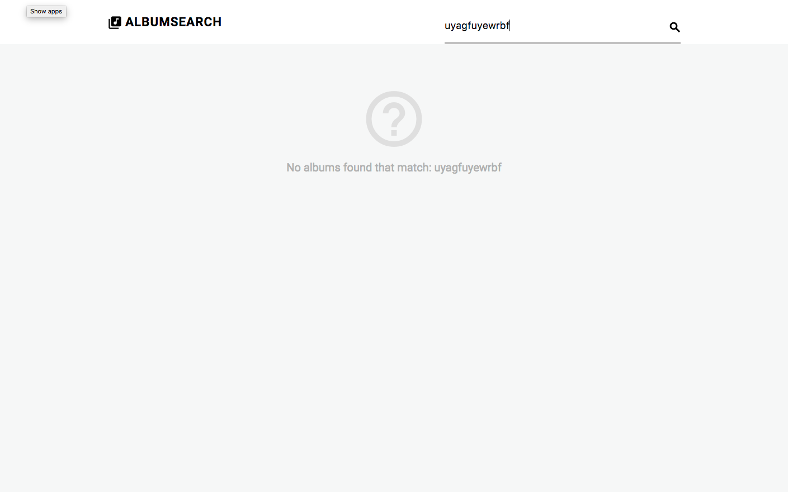
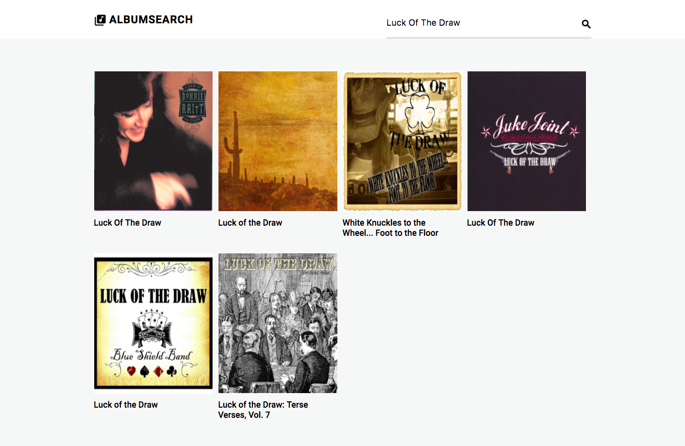
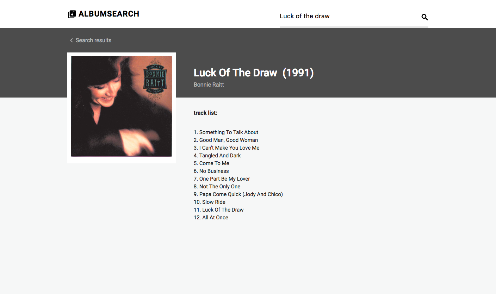

# Use a Public API to Build a Search App
>Treehouse Techdegree Project #5

Built a "Album Search" app using the Spotify API.  The search form of the application return album data in JSON format . And used the API data to dynamically create HTML displaying an album's title, artist, and album art image. If click the image, the application return details for an album. 

### Used Skills: jQuery, AJAX

## Images In ReadMes
### 

